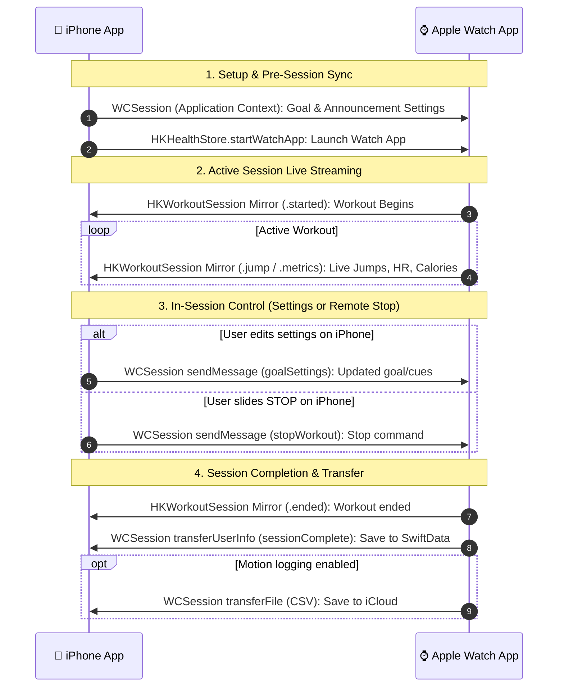

# iPhone ↔ Apple Watch Message Flows

This document details all communication pathways between the JumpRec iPhone app and Apple Watch app, sorted by communication channel, direction, payload models, and system triggers.

---

## 🛰️ Channel 1: WatchConnectivity (`WCSession`)
Used for app settings synchronization, lifecycle status, completed workout transfers, raw CSV motion exports, and remote control commands.

### 📱 iPhone ➔ ⌚ Apple Watch

#### 1. Companion Workout Launch
* **Method**: `healthStore.startWatchApp(toHandle: configuration)`
* **File**: [WorkoutMirrorManager.swift](file:///Users/kin/Documents/GitHub/JumpRec/JumpRec/Logics/WorkoutMirrorManager.swift#L39-L51)
* **Payload**: `HKWorkoutConfiguration` (`activityType: .jumpRope`, `locationType: .outdoor`)
* **Purpose**: Remotely wakes/launches the JumpRec Watch app from iPhone to prepare for a mirrored jump session.

#### 2. Goal & App Settings Sync
* **Method**: `ConnectivityManager.shared.updateGoalSettings(...)` (`WCSession.updateApplicationContext` + `WCSession.sendMessage`)
* **Files**: [ConnectivityManager.swift (iPhone)](file:///Users/kin/Documents/GitHub/JumpRec/JumpRec/Logics/ConnectivityManager.swift#L254-L283) ➔ [ConnectivityManager.swift (Watch)](file:///Users/kin/Documents/GitHub/JumpRec/JumpRec%20Watch%20App/Logics/ConnectivityManager.swift#L115-L173)
* **Payload**:
  ```json
  {
    "type": "goalSettings",
    "goalType": "count" | "time",
    "jumpCount": Int,
    "jumpTime": Int,
    "shouldSpeakJumpCountAnnouncements": Bool,
    "shouldSpeakJumpTimeAnnouncements": Bool,
    "jumpDetectorThresholdAdjustmentPercentage": Double
  }
  ```
* **Purpose**: Synchronizes user goals, detection thresholds, and spoken announcement preferences across both devices.

#### 3. Remote Stop Command
* **Method**: `ConnectivityManager.shared.sendStopSessionCommand()` (`WCSession.sendMessage`)
* **Files**: [ConnectivityManager.swift (iPhone)](file:///Users/kin/Documents/GitHub/JumpRec/JumpRec/Logics/ConnectivityManager.swift#L285-L299) ➔ [ConnectivityManager.swift (Watch)](file:///Users/kin/Documents/GitHub/JumpRec/JumpRec%20Watch%20App/Logics/ConnectivityManager.swift#L69-L78)
* **Payload**: `{"action": "stopWorkout"}`
* **Purpose**: Sent when the user completes the "STOP SESSION" slider on iPhone during a mirrored workout to instruct the Watch app to finish its active session remotely.

---

### ⌚ Apple Watch ➔ 📱 iPhone

#### 1. Watch Session Lifecycle Status
* **Method**: `ConnectivityManager.shared.sendMessage(...)`
* **Files**: [AppState+SessionLifecycle.swift (Watch)](file:///Users/kin/Documents/GitHub/JumpRec/JumpRec%20Watch%20App/Models/AppState+SessionLifecycle.swift#L51) ➔ [ConnectivityManager.swift (iPhone)](file:///Users/kin/Documents/GitHub/JumpRec/JumpRec/Logics/ConnectivityManager.swift#L110-L115)
* **Payload**: `{"watch app": "started"}` or `{"watch app": "finished"}`
* **Purpose**: Logs Watch-side state transitions on iPhone for debugging.

#### 2. Completed Session Persistence Transfer
* **Method**: `ConnectivityManager.shared.sendCompletedSession(...)` (`WCSession.transferUserInfo`)
* **Files**: [ConnectivityManager.swift (Watch)](file:///Users/kin/Documents/GitHub/JumpRec/JumpRec%20Watch%20App/Logics/ConnectivityManager.swift#L86-L107) ➔ [ConnectivityManager.swift (iPhone)](file:///Users/kin/Documents/GitHub/JumpRec/JumpRec/Logics/ConnectivityManager.swift#L172-L245)
* **Payload**:
  ```json
  {
    "type": "sessionComplete",
    "startedAt": Double (timestamp),
    "endedAt": Double (timestamp),
    "jumpCount": Int,
    "caloriesBurned": Double,
    "jumpOffsets": [Double],
    "averageHeartRate": Int?,
    "peakHeartRate": Int?
  }
  ```
* **Purpose**: Background-durable delivery of completed workout results to iPhone to be persisted in SwiftData (`JumpSession`).

#### 3. Raw Motion CSV Export
* **Method**: `ConnectivityManager.shared.sendCSV(...)` (`WCSession.transferFile`, fallback `transferUserInfo`)
* **Files**: [ConnectivityManager.swift (Watch)](file:///Users/kin/Documents/GitHub/JumpRec/JumpRec%20Watch%20App/Logics/ConnectivityManager.swift#L52-L66) ➔ [ConnectivityManager.swift (iPhone)](file:///Users/kin/Documents/GitHub/JumpRec/JumpRec/Logics/ConnectivityManager.swift#L149-L166)
* **Payload**: CSV file attachment (`metadata: ["filename": filename]`) or fallback `{"csvText": String, "filename": String}`
* **Purpose**: Transfers recorded accelerometer/motion logs to iPhone for iCloud Drive/Documents storage.

---

## 🏃 Channel 2: HealthKit Workout Mirroring (`HKWorkoutSession`)
Used exclusively for low-latency live streaming during an active workout session.

### ⌚ Apple Watch ➔ 📱 iPhone (Live Streaming)

* **Transport**: `HKWorkoutSession.sendToRemoteWorkoutSession(data:)` ➔ received by `workoutSession(_:didReceiveDataFromRemoteWorkoutSession:)`
* **Files**: [WorkoutManager.swift (Watch)](file:///Users/kin/Documents/GitHub/JumpRec/JumpRec%20Watch%20App/Logics/WorkoutManager.swift#L453-L463) ➔ [WorkoutMirrorManager.swift (iPhone)](file:///Users/kin/Documents/GitHub/JumpRec/JumpRec/Logics/WorkoutMirrorManager.swift#L80-L97) ➔ [AppState+MirroredWorkout.swift (iPhone)](file:///Users/kin/Documents/GitHub/JumpRec/JumpRec/Models/AppState+MirroredWorkout.swift#L12-L25)
* **Data Structure**: `MirroredWorkoutPayload` (Codable struct)

| Event / Kind | Data Sent | iPhone Action |
| :--- | :--- | :--- |
| **`.started`** | `startTime`, initial `jumpCount`, `goalType`, `goalValue` | Sets iPhone session state to `.active`, source to `.watch`, and initializes live UI ring. |
| **`.jump`** | `jumpCount`, `jumpOffset`, `energyBurned`, `heartRate`, `averageHeartRate`, `peakHeartRate` | Increments jump count ring, appends jump timestamp offset, updates active stat cards with current heart rate. |
| **`.metrics`** | `energyBurned`, `heartRate`, `averageHeartRate`, `peakHeartRate` | Updates current heart rate and calorie metrics on iPhone stat grid. |
| **`.ended`** | `endTime`, final `energyBurned`, `heartRate`, `averageHeartRate`, `peakHeartRate` | Transitions iPhone UI to `.complete` state and displays session summary. |

---

## 🔄 Sequence Overview


